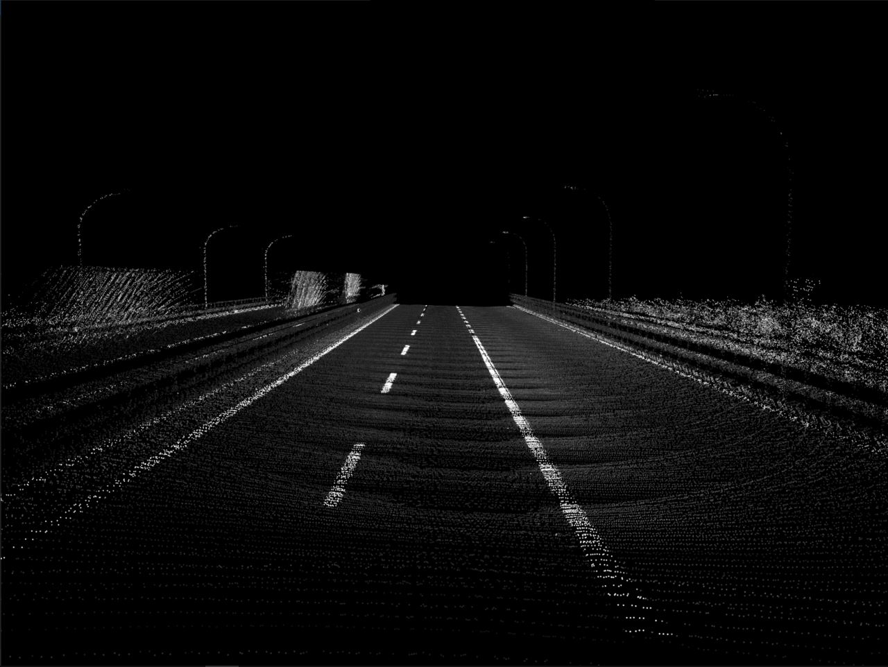
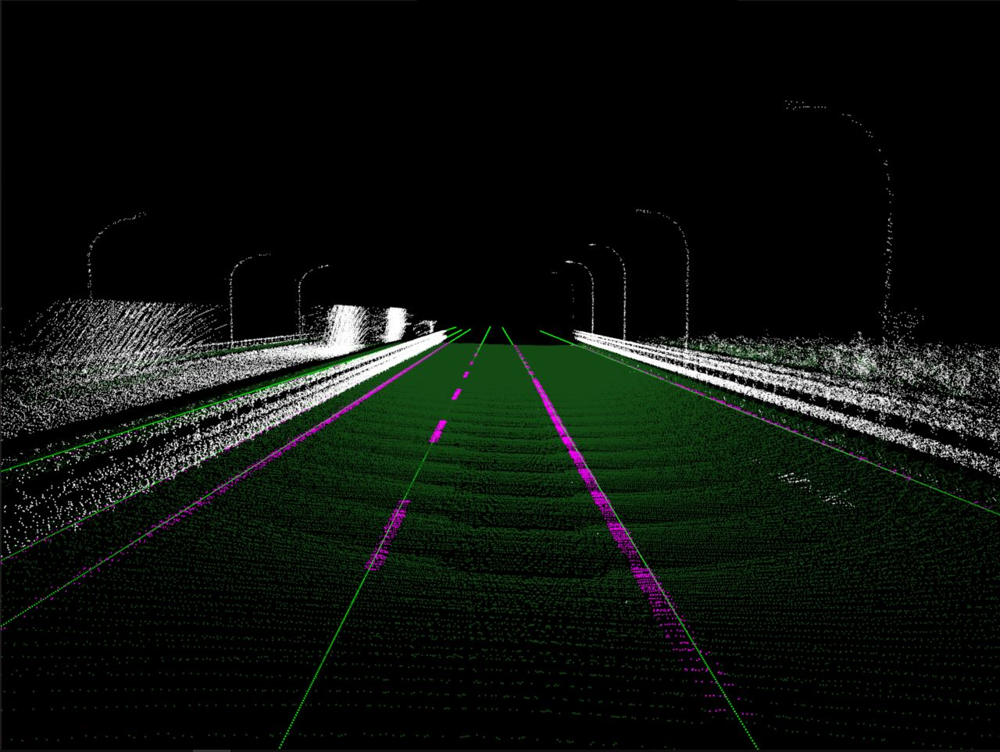

# LIDAR Lane Detection

Vincent Tran  
  
Project explanation can be found in the [presentation](docs/LIDAR%20Lane%20Detection.pdf).

## Language

Python 3.6.5  


## Libraries

```
$ pip install pptk  
$ pip install numpy
```

## Execution

```
$ python runLaneDetection.py  
```  

## Output

pptk will automatically open with the visualization of the detected lanes  

  